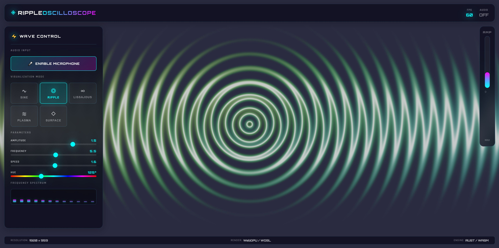
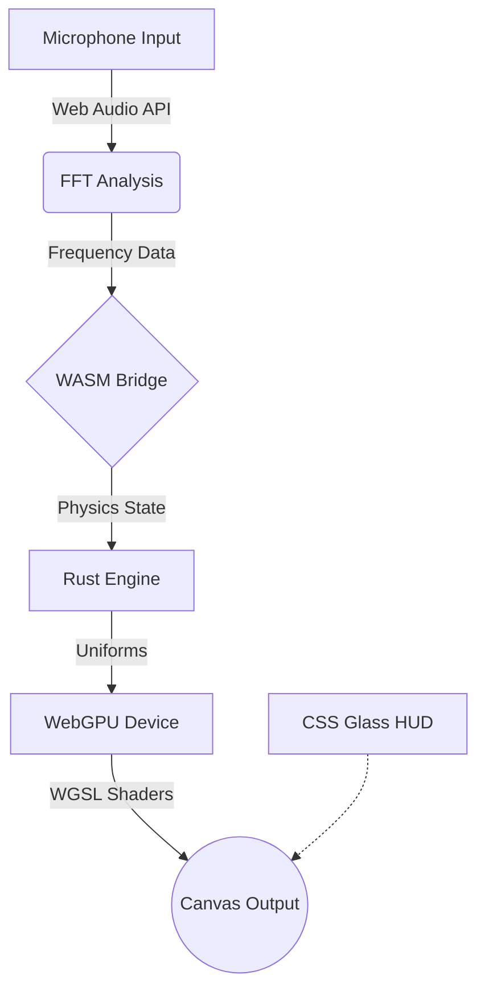

# ◈ RIPPLE-OSCILLOSCOPE ◈


> **"Where Physics Meets Art"** - A next-generation audio visualizer powered by Rust, WebGPU, and pure Mathematics.

---

## ⚡ Overview

**RIPPLE-Oscilloscope** pushes the boundaries of web graphics by combining the raw performance of **Rust** and **WebGPU** with the accessibility of the web. 

Unlike traditional canvas visualizers, this project renders millions of operations per second directly on your GPU using **WGSL shaders**. The result is a fluid, 60fps experience that transforms your audio into stunning 3D wave physics simulations.


## ✨ Key Features

### 🌊 5 Physics-Based Visualizers
*   **∿ SINE**: Classic oscillating waves with additive synthesis
*   **◎ RIPPLE**: Dynamic hydro-dynamic circular propagation
*   **∞ LISSAJOUS**: Complex orbital interference patterns
*   **≋ PLASMA**: Fluid-like energy field simulation
*   **◇ SURFACE**: 3D terrain generation based on audio frequency

### 🎨 Premium UI/UX
*   **Glassmorphism HUD**: Frosted glass panels with real-time backdrop blur
*   **Neon Aesthetics**: Cyberpunk-inspired color palettes (Cyan/Magenta)
*   **Micro-Animations**: Interactive glow effects and smooth transitions
*   **Responsive Design**: Adapts perfectly to any screen size

### 🚀 High-Performance Engine
*   **Rust Core**: Physics logic compiled to highly optimized WebAssembly
*   **WebGPU Renderer**: Next-gen graphics API for metal-level performance
*   **WGSL Shaders**: Custom shader programs for wave displacement and lighting
*   **Web Audio API**: Real-time FFT (Fast Fourier Transform) frequency analysis

---

## 🛠️ Architecture



---

## 🚀 Quick Start

### Prerequisites
*   A modern browser with **WebGPU support** (Chrome 121+, Edge 121+, Firefox Nightly)
*   Microphone access

### Running Locally

1.  **Clone the Repository**
    ```bash
    git clone https://github.com/plantacerium/RippleOscilloscope.git
    cd RippleOscilloscope/web
    ```

2.  **Start a Local Server**
    (Python 3 example)
    ```bash
    python -m http.server 8080
    ```

3.  **Launch**
    Open `http://localhost:8080` in your browser.

4.  **Activate**
    Click **"ENABLE MICROPHONE"** and watch the physics come alive!

---

## 🎮 Controls

| Control | Function |
| :--- | :--- |
| **Modes** | Switch between Sine, Ripple, Lissajous, Plasma, Surface |
| **Amplitude** | Boosts the visual impact of the waves |
| **Frequency** | Changes the density and scale of patterns |
| **Speed** | Controls the time-dilation of the simulation |
| **Hue** | Shifts the entire color spectrum |

---

## 📦 Tech Stack

*   **Language**: Rust (2021 Edition)
*   **Graphics**: WGPU (WebGPU implementation)
*   **Shaders**: WGSL (WebGPU Shading Language)
*   **Target**: WebAssembly (wasm32-unknown-unknown)
*   **Styling**: Pure CSS3 with Glassmorphism
*   **Build Tool**: wasm-pack

---

<div align="center">

**Made with ❤️ and ☕ by Plantacerium**

[](https://ko-fi.com/plantacerium)

⭐ **Star us on GitHub** ⭐
</div>


